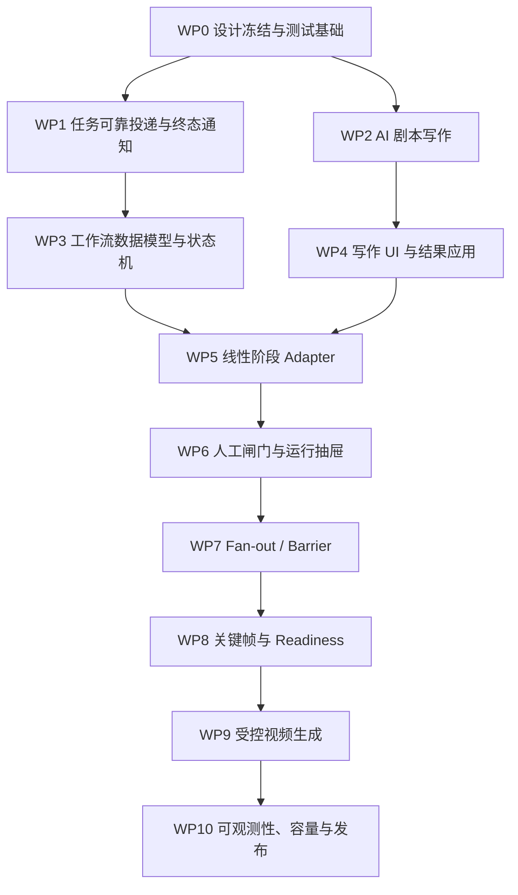

> 本计划不估算自然日或人周，按技术依赖和可独立验收的工作包推进。需求与设计见[需求方案](/docs/plans/ai-script-production-workflow/)和[详细技术设计](/docs/plans/ai-script-production-technical-design/)。

## 1. 推进原则

1. 先完成任务可靠性基础，再串联更多阶段。
2. AI 写作先独立可用，再接入工作流。
3. 前半段线性编排稳定后，再实现按镜头 fan-out。
4. 人工闸门与恢复能力必须和自动执行同时交付。
5. 每个阶段都同步 OpenAPI、generated client、测试和文档。
6. 不在重构未完成时从工作流复制 route 逻辑。

## 2. 工作包依赖



## 3. WP0：设计冻结与测试基础

### 任务

- 确认六项产品决策：写作粒度、应用字段、已有镜头策略、视频确认、模型解析时机、preset 范围。
- 固化 manifest v1 和错误码。
- 建立测试数据 P1/P2/P3。
- 增加 MySQL + Redis + Celery 集成测试入口。
- 前端引入 Vitest、Testing Library、MSW 测试约定。
- 建立 Playwright Compose E2E 骨架。

### 产物

- 决策记录。
- 测试 fixture 和 Provider stub。
- CI 测试任务。

### 退出标准

- Manifest、状态迁移和错误码无待定项。
- MySQL 并发测试与前端组件测试可在 CI 运行。
- 不依赖真实 Provider 完成确定性测试。

## 4. WP1：任务可靠投递与终态通知

### 任务

- 新增 `task_dispatch_outbox`。
- 将任务创建与 outbox 写入同一事务。
- 实现 dispatcher 和退避重试。
- 在 `task.execute` 终态提交后接入统一通知。
- 覆盖 API 直接取消通知。
- 增加 reconciliation 基础扫描。
- 清理图片/视频任务 payload 中的 Provider Key，改为 Worker 解析。

### 前置重构

- 拆分 `create_image_task_and_link` 的 create/commit/enqueue。
- 下沉帧提示词和视频 task 创建逻辑。

### 退出标准

- “创建后、投递前崩溃”可恢复。
- 通知丢失可由 Reconciler 修复。
- 重复 dispatcher/notification 不产生重复任务。
- Provider Key 不进入新任务 payload 和日志。

### 当前落地进度

- 已完成最小基础：`task_dispatch_outbox` ORM、幂等 MySQL SQL、统一
  dispatcher/退避重试和 stale outbox reconciliation。
- 分镜帧提示词任务已作为首个低风险创建路径接入；其他任务创建路径仍使用
  兼容 `enqueue_task_execution`，待分批迁移。
- `task.execute` 终态通知已能结算 production workflow binding；线性编排的
  通知丢失由 production Reconciler 修复。
- `script_write`、`script_divide`、`script_extract` 已接入 outbox；其他业务
  创建路径迁移以及 Provider Key payload 清理仍按后续工作推进。

## 5. WP2：AI 剧本写作后端

状态：后端能力已落地。五种写作模式、默认 text 模型 executor、可靠 outbox
投递、异步 API，以及带章节乐观锁和稳定应用记录的显式 apply API 已实现；
后续前端接入归入 WP4。

### 任务

- 新增 `script_writing` contracts。
- 实现 `ScriptWriterAgent`。
- 增加 `script_write` task service、executor 和 registry。
- 复用默认 text 模型 resolver。
- 实现 structured output 校验与一次受控修复。
- 增加写作任务 API。
- 实现显式 apply API 与章节乐观锁。

### 测试

- 五种写作模式。
- 非法输出、超长输出和 Provider 错误。
- 应用结果版本冲突与幂等。
- Key 和原始 Provider 响应不泄漏。

### 退出标准

- 用户可通过 API 生成候选剧本并显式应用。
- 写作完成不会自动覆盖章节。
- 缺少默认文本模型时返回可操作错误。

## 6. WP3：工作流数据模型与状态机

### 任务

- 新增 Run、Step、StepItem、Binding、Transition 表。
- 创建 MySQL 幂等 SQL、索引和唯一约束。
- 更新 SQLite `init_db()` 模型导入。
- 实现 ManifestService。
- 实现 TransitionService 与锁顺序。
- 实现同章单活跃运行约束。
- 实现创建、启动、暂停、恢复、取消 API。

### 测试

- 状态转换与非法转换。
- 20 并发创建同章 run。
- Mutation 版本冲突和幂等键。
- 迁移重复执行。

### 退出标准

- 运行可创建并保存完整 manifest 快照。
- 所有状态修改只通过 TransitionService。
- 并发下只存在一个活跃运行。

## 7. WP4：AI 写作前端

状态：章节 Tab 的五模式写作入口、`script_write` 创建与独立轮询、结构化候选审阅、
`raw_text / condensed_text` 显式应用和 `409` 冲突处理已落地，且统一使用 generated
client。跨页面草稿持久化和独立模型预检仍属于后续增强。

### 任务

- 章节 Tab 增加“AI 写剧本”。
- 实现四步写作向导。
- 实现输入校验、草稿保留和模型预检。
- 实现结果对照、目标字段选择和应用。
- 处理章节 409 冲突。
- 使用 generated client。

### 退出标准

- 用户能从设定生成、审阅和应用剧本。
- 刷新页面后任务可恢复。
- 密码、Provider Key 和 Session Token 不进入页面状态。
- 375px/768px/1024px/1440px 基础可用。

## 8. WP5：线性阶段编排

状态：`script_assist` 与三个准备类 preset 的线性文本处理已落地，包括可选
`simplify → consistency → optimize`、结果向 divide/extract 的传递、StageAdapter
registry、任务 binding、terminal settlement、outbox 和停滞运行 reconciliation。
start/resume/confirm 与 terminal settlement 均在事务提交后立即按 run 投递 due
outbox，失败由 outbox reconciliation 兜底。frame/image/video fan-out 不在该
子集范围内。

### 任务

- 实现 StageAdapter Registry。
- [x] 实现 consistency、optimize、simplify、divide、extract adapter。
- 现有 task service 支持外部幂等键和 run binding。
- 实现 terminal settlement。
- 扩展 Reconciler 推进停滞步骤。
- [x] 实现 `prepare_shots` preset。

### 注意

- optimize 和 simplify 不默认同时执行，由 preset/config 决定。
- 已存在镜头时 divide 默认阻断。
- Extract 完成后必须进入 preparation gate。

### 退出标准

- 已有剧本可自动推进到候选确认前。
- Worker 重启后可恢复。
- 手动任务与工作流任务冲突可识别。

## 9. WP6：人工闸门与运行 UI

状态：后端 ScriptReview、Preparation GateService 与 confirm API 已落地；
ProductionRunDrawer、独立 run polling 和分镜编辑页 preparation gate 确认入口也已落地。
运行抽屉现已接入 fan-out item 分页、阻断原因、定向 retry/skip，以及
`video_submit_gate` 的生成摘要和显式确认。

### 任务

- 实现 ScriptReview、Preparation GateService。
- 保存 gate snapshot hash 与确认审计。
- 新增 confirm API，禁止 resume 绕过。
- 实现 ProductionRunDrawer 和阶段时间线。
- 分镜编辑页增加“确认并继续”。
- Run polling 与 TaskCenter polling 分离。

### 退出标准

- 不满足 preparation-state 时无法继续。
- 确认后实体变化会让闸门失效。
- 抽屉展示阶段与恢复动作，不承载完整业务详情。

## 10. WP7：Fan-out、StepItem 与 Barrier

状态：后端目标冻结、StepItem、binding/outbox、barrier、partial、定向 retry/skip
及删除目标跳过已落地，前端 item 操作入口也已接入 ProductionRunDrawer。部署仍保持
既有单 Worker 并发配置；100 镜头真实环境容量验证仍待推进。

### 任务

- 进入 fan-out 时冻结 shot 目标集合。
- 批量创建 StepItem、Binding、Task 和 Outbox。
- 实现 barrier 聚合。
- 实现 partial、定向 retry 和 skip。
- 处理新增/删除镜头。
- 加入部署级并发限制，VPS 默认重型任务串行。

### 退出标准

- 100 镜头 fan-out 不重复。
- 单项失败不回滚成功项。
- Barrier 只结算一次。
- 全 skipped、partial、failed 语义正确。

## 11. WP8：关键帧与 Readiness

状态：后端 FramePrompt、FrameImage 和 VideoReadiness adapters 已落地；图片任务
已接入 outbox，readiness 阻断会进入 `waiting_human` 并可在运行抽屉逐镜头查看、
定向重算；业务修复入口回到分镜工作室。

### 任务

- 实现 FramePrompt、FrameImage Adapter。
- 定义 preset 的帧类型策略。
- 实现章节目标集合 readiness barrier。
- 工作室展示阻断清单和精确修复入口。
- 复用默认 image 模型和 capability 校验。

### 退出标准

- 确认镜头可自动准备关键帧。
- Readiness 不通过时不创建视频任务。
- 修复后可重新计算并解除阻断。

## 12. WP9：受控视频生成

状态：后端 `controlled_video` manifest、VideoSubmitGate、VideoGeneration adapter
和原有视频结果回流已落地；视频任务只在 gate 显式确认后派发。前端已展示冻结镜头数、
参考模式、比例和模型摘要，并提供显式提交确认及视频生成 item 定向恢复。

### 任务

- 实现 VideoSubmit Gate。
- 展示目标镜头数、默认模型和关键参数摘要。
- 实现 VideoGeneration Adapter。
- 复用现有视频结果回流。
- 实现取消、部分失败和定向重试。
- 完成 `controlled_video` preset。

### 退出标准

- 视频提交始终需要显式确认。
- 运行期间修改镜头会触发重新 preflight。
- 成功结果进入镜头与素材库。
- 任务中心只显示视频子任务。

## 13. WP10：可观测性、容量与发布

### 任务

- 增加结构化运行日志与指标。
- 建立 outbox/reconciliation 告警。
- 完成 100 镜头性能测试。
- 完成 Worker、Redis、backend 重启恢复。
- 执行真实 Provider 低成本冒烟。
- 完成 VPS 升级与回滚演练。
- 将已落地事实从 plans 沉淀到 architecture。

### 退出标准

- 测试文档中的发布候选门禁全部通过。
- 无重复派发、静默覆盖、闸门绕过和密钥泄漏。
- 单 Worker VPS 资源限制内可稳定运行。

## 14. 每个工作包的 Definition of Done

- 功能代码与必要注释完成，无占位逻辑。
- API 变化已运行 `pnpm run openapi:update`。
- 前端只使用 generated client。
- 后端定向测试、完整 pytest 和 Pylint 通过。
- 前端 `pnpm exec tsc --noEmit` 与组件测试通过。
- MySQL 并发/迁移测试按范围通过。
- 对应文档同步更新。
- 页面职责和四类状态语义未被破坏。
- 变更有回滚路径和可观测日志。

## 15. 建议提交边界

每个提交保持单一逻辑：

1. Schema 与迁移。
2. Contracts 与模型。
3. 可靠投递基础。
4. 单个 Adapter 或状态服务。
5. API 与 OpenAPI。
6. 前端组件与 generated client 接入。
7. 测试。
8. 文档。

不要把工作流全链路作为一个巨型提交；每个工作包应可独立回滚。

## 16. 风险与阻断

| 风险 | 处理 |
| --- | --- |
| Route 逻辑无法复用 | 先下沉 service，再接 Adapter。 |
| 任务创建与投递不原子 | WP1 先完成 outbox。 |
| MySQL 并发行为未验证 | 不允许仅凭 SQLite 测试进入下一阶段。 |
| 1 vCPU Worker 吞吐低 | 重型 Item 串行，保持可暂停和可观察。 |
| Provider 输出不稳定 | Structured output + 校验 + 人工应用。 |
| 前端巨型页面继续膨胀 | 新 production 模块独立组件化。 |
| 需求继续扩大为通用编排器 | MVP 固定 preset 和 manifest v1。 |

## 17. 交付顺序建议

首个可发布增量：

```text
WP0 → WP1 → WP2 → WP4
```

得到独立可用的 AI 写作功能。

第二个可发布增量：

```text
WP3 → WP5 → WP6
```

得到自动推进到人工候选确认的工作流。

第三个可发布增量：

```text
WP7 → WP8
```

得到确认后自动生成准备。

第四个可发布增量：

```text
WP9 → WP10
```

得到受控视频生成和完整运营能力。
