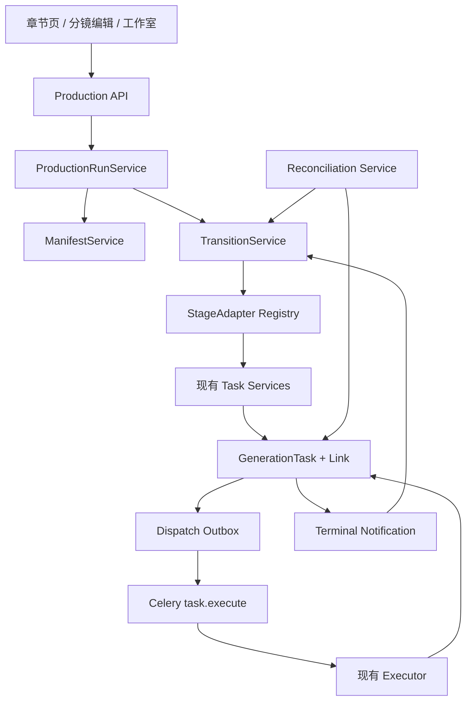

> 本文是待实施技术设计。需求、产品边界和用户流程见[AI 剧本写作与自动生产工作流方案](/docs/plans/ai-script-production-workflow/)；测试与交付计划分别见[测试用例文档](/docs/plans/ai-script-production-test-plan/)和[开发计划](/docs/plans/ai-script-production-development-plan/)。

## 1. 设计目标与边界

### 1.1 目标

- 在现有 `GenerationTask`、Celery、剧本处理和生成 service 之上增加可靠编排。
- 新增 AI 剧本写作，并复用系统 `ModelSettings` 默认模型。
- 支持暂停、人工确认、取消、部分成功、定向重试和 Worker 重启恢复。
- 保持分镜编辑页负责准备、分镜工作室负责生成、任务中心负责轻量任务状态。

### 1.2 非目标

- 不建设任意拖拽 DAG 编辑器。
- 不创建替代 `GenerationTask` 的任务系统。
- 不允许工作流绕过剧本审阅、候选确认和视频提交闸门。
- 不在工作流中保存 Provider 密钥或增加独立模型设置。
- 不在一个数据库事务或一个 Celery 任务中执行完整流程。

## 2. 总体架构



核心真相：

| 领域 | 唯一真相 |
| --- | --- |
| 工作流编排 | `ChapterProductionRun / Step / StepItem` |
| 单个执行任务 | `GenerationTask` |
| 任务业务关联 | `GenerationTaskLink` |
| 镜头确认 | `shot.status` 与 preparation-state |
| 视频生成条件 | video-readiness service |
| 默认模型 | `ModelSettings` |

## 3. 模块结构

### 3.1 后端

```text
backend/app/
├─ core/contracts/script_writing.py
├─ chains/agents/script_writer_agent.py
├─ models/production_runs.py
├─ schemas/production_runs.py
├─ services/studio/production/
│  ├─ run_service.py
│  ├─ manifest_service.py
│  ├─ transition_service.py
│  ├─ dispatch_service.py
│  ├─ task_binding_service.py
│  ├─ gate_service.py
│  ├─ reconciliation_service.py
│  ├─ errors.py
│  └─ adapters/
└─ api/v1/routes/studio/production_runs.py
```

职责：

| 模块 | 职责 |
| --- | --- |
| API | 收参、管理员会话鉴权、调用 service、响应组织。 |
| RunService | 创建、启动、暂停、恢复、取消和读取运行。 |
| ManifestService | 将固定 preset 展开为版本化步骤图。 |
| TransitionService | 唯一允许修改 run/step/item 状态的服务。 |
| DispatchService | 原子创建任务、关联、绑定和 outbox。 |
| GateService | 重新计算人工闸门条件和快照。 |
| ReconciliationService | 修复通知丢失、未投递和运行停滞。 |
| StageAdapter | 将工作流阶段映射到现有 service，不直接调用 Provider。 |

### 3.2 前端

```text
front/src/pages/aiStudio/production/
├─ components/
│  ├─ ScriptWritingWizard.tsx
│  ├─ ScriptResultReview.tsx
│  ├─ ProductionRunDrawer.tsx
│  ├─ ProductionStageTimeline.tsx
│  ├─ ProductionStepPanel.tsx
│  ├─ ProductionItemList.tsx
│  ├─ ProductionGatePanel.tsx
│  └─ ProductionBlockedReasons.tsx
├─ hooks/
│  ├─ useProductionRun.ts
│  ├─ useProductionRunPolling.ts
│  └─ useProductionRunMutations.ts
└─ productionRunUi.ts
```

接入点：

- `ChaptersTab`：AI 写剧本、自动生产入口与运行摘要。
- `ChapterRawTextEditorModal`：结果对照和应用。
- `ChapterShotEditPage`：准备闸门确认。
- `ChapterStudio`：readiness 阻断与视频提交闸门。
- `TaskCenter`：仅继续展示子 GenerationTask。

## 4. 数据模型

### 4.1 `chapter_production_runs`

| 字段 | 建议类型 | 说明 |
| --- | --- | --- |
| `id` | varchar(64) PK | 运行 ID。 |
| `project_id` | varchar(64) FK | 项目归属。 |
| `chapter_id` | varchar(64) FK | 章节归属。 |
| `preset_key` | varchar(64) | 固定预设。 |
| `manifest_version` | varchar(32) | manifest 版本。 |
| `manifest_snapshot` | JSON | 展开后的阶段图。 |
| `config_snapshot` | JSON | 运行参数快照。 |
| `input_snapshot` | JSON | 启动输入与实体版本摘要。 |
| `target_snapshot_hash` | varchar(64) | 目标集合哈希。 |
| `status` | varchar(32) | 总体状态。 |
| `current_step_id` | varchar(64)? | 当前步骤。 |
| `lock_version` | bigint | API 乐观锁。 |
| `transition_version` | bigint | 状态推进幂等版本。 |
| `cancel_requested` | boolean | 取消请求。 |
| `error_code/message` | string/text? | 标准化错误。 |
| `last_reconciled_at` | datetime? | 最近对账时间。 |
| `started_at/finished_at` | datetime? | 指标。 |
| `created_at/updated_at` | datetime | 审计时间。 |

状态：

```text
draft / running / waiting_human / paused / succeeded / failed / cancelled
```

同章节只允许一个活跃运行。MySQL 建议使用生成列：

```text
active_chapter_id =
  CASE WHEN status IN ('draft','running','waiting_human','paused','failed')
       THEN chapter_id
       ELSE NULL
  END
```

并建立：

```text
UNIQUE(active_chapter_id)
INDEX(chapter_id, created_at)
INDEX(status, updated_at)
INDEX(status, last_reconciled_at, updated_at)
```

`failed` 占用活跃槽，用户必须重试或取消后才能创建新运行。

### 4.2 `chapter_production_run_steps`

| 字段 | 说明 |
| --- | --- |
| `id/run_id` | 步骤及所属运行。 |
| `stage_key/sequence` | 阶段标识与显示顺序。 |
| `adapter_version` | adapter 版本。 |
| `execution_mode` | linear / fan_out / barrier / gate。 |
| `status` | pending/running/waiting/partial/succeeded/failed/skipped/cancelled。 |
| `attempt` | 步骤重试次数。 |
| `idempotency_key` | 步骤创建幂等键。 |
| `input_snapshot/target_snapshot` | 输入和目标快照。 |
| `output_summary/blocked_reasons` | 轻量输出与阻断。 |
| `gate_snapshot_hash` | 闸门确认版本。 |
| `confirmed_by/confirmed_at` | 确认审计。 |
| `lock_version` | 步骤乐观锁。 |
| `started_at/finished_at` | 指标。 |

约束：

```text
UNIQUE(run_id, sequence)
UNIQUE(run_id, idempotency_key)
INDEX(run_id, status, sequence)
```

不使用 `UNIQUE(run_id, stage_key)`，允许未来 manifest 合法重复同类阶段。

### 4.3 `chapter_production_run_step_items`

| 字段 | 说明 |
| --- | --- |
| `id/step_id` | 项及所属步骤。 |
| `entity_type/entity_id` | 目标实体，通常为 shot。 |
| `target_key` | 如 `shot:{id}:first`，区分帧类型。 |
| `entity_version` | 目标冻结版本。 |
| `status/attempt` | 单项状态与重试次数。 |
| `idempotency_key` | 单项幂等键。 |
| `blocked_reasons` | readiness 或前置条件。 |
| `output_ref` | 文件、帧图或视频引用。 |
| `lock_version` | 乐观锁。 |

约束：

```text
UNIQUE(step_id, target_key)
UNIQUE(step_id, idempotency_key)
INDEX(step_id, status)
INDEX(entity_type, entity_id)
```

### 4.4 `production_run_task_bindings`

任务重试必须保留历史，不能在 step/item 上覆盖单一 `task_id`。

| 字段 | 说明 |
| --- | --- |
| `run_id/step_id/item_id?` | 工作流归属。 |
| `task_id` | GenerationTask ID。 |
| `attempt/task_kind` | 尝试次数和任务类型。 |
| `binding_role` | primary / child。 |
| `terminal_status/notified_at` | 终态通知记录。 |

约束：

```text
UNIQUE(task_id)
UNIQUE(step_id, item_id, attempt, task_kind)
INDEX(run_id, step_id)
INDEX(task_id, notified_at)
```

`GenerationTaskLink` 继续表达项目、章节、镜头和媒体关联；binding 专门表达工作流尝试历史。

### 4.5 `production_run_transitions`

用于审计和推进幂等：

```text
run_id
step_id?
transition_version
event_type
from_status
to_status
actor_type
actor_id?
event_payload
created_at
UNIQUE(run_id, transition_version)
```

### 4.6 `task_dispatch_outbox`

解决“数据库已提交、Celery 尚未投递时进程崩溃”的丢任务窗口：

```text
id
task_id UNIQUE
status            # pending/dispatched/failed
attempt
available_at
dispatched_at?
last_error?
created_at/updated_at
INDEX(status, available_at)
```

同一事务内创建 GenerationTask、Link、binding 和 outbox。Dispatcher 在事务外投递，失败后按退避策略重试。

## 5. Manifest 与预设

MVP 固定四个预设：

```text
script_assist
prepare_shots
prepare_frames
controlled_video
```

Manifest 示例：

```json
{
  "version": "v1",
  "preset": "prepare_frames",
  "steps": [
    {"key": "script_divide", "mode": "linear"},
    {"key": "script_extract", "mode": "linear"},
    {"key": "human_preparation_gate", "mode": "gate"},
    {"key": "frame_prompt", "mode": "fan_out"},
    {"key": "frame_image", "mode": "fan_out"},
    {"key": "video_readiness", "mode": "barrier"}
  ]
}
```

创建 run 时保存完整快照。更新预设不改变已启动运行。

## 6. StageAdapter

### 6.1 接口

```python
class StageAdapter(Protocol):
    stage_key: ProductionStage
    adapter_version: str
    execution_mode: ExecutionMode

    def preflight(self, ctx: StageContext) -> PreflightResult: ...
    def resolve_targets(self, ctx: StageContext) -> list[StageTarget]: ...
    def build_dispatches(
        self,
        ctx: StageContext,
        targets: list[StageTarget],
    ) -> list[TaskDispatchSpec]: ...
    def inspect_task_result(
        self,
        ctx: StageContext,
        binding: TaskBinding,
        task: GenerationTask,
    ) -> ItemSettlement: ...
    def aggregate(
        self,
        ctx: StageContext,
        settlements: list[ItemSettlement],
    ) -> StageSettlement: ...
```

Adapter 只返回结算结果；状态迁移统一由 TransitionService 执行。

### 6.2 DTO

- `StageContext`：run、step、manifest、chapter snapshot、DB session。
- `PreflightIssue`：code、message、retryable、blocking、entity_ref、action_url。
- `StageTarget`：target_key、entity ref/version、input snapshot。
- `TaskDispatchSpec`：task_kind、relation、payload、idempotency_key。
- `ItemSettlement`：终态、输出引用、标准错误。
- `StageSettlement`：barrier 是否满足、partial 状态和下一动作。

### 6.3 禁止行为

- 不发起内部 HTTP 请求。
- 不复制 route 中任务创建逻辑。
- 不直接调用 Provider。
- 不绕过 GenerationTask 执行长任务。
- 不直接修改 run/step/item 状态。

## 7. 现有能力复用与前置重构

| 阶段 | 复用 | 必要调整 |
| --- | --- | --- |
| consistency/optimize/simplify/divide/extract | `script_processing_tasks.py` 与现有 worker executor | 支持外部幂等键和 run binding。 |
| 帧提示词 | `shot_frame_prompt` executor | route 创建逻辑下沉为 service。 |
| 帧图 | `create_image_task_and_link` | 拆分事务内 create 与事务后 dispatch。 |
| 视频 | `build_run_args` 与 `video_generation` executor | route 中创建、关联、commit、enqueue 下沉。 |
| readiness | `shot_video_readiness.py` service | 增加章节目标集合聚合 adapter。 |
| 写作 | 无 | 新增 contract、Agent、executor 和 task service。 |

新增 `script_write` 注册到 `TaskExecutorRegistry`。其他 task kind 保持不变。

任务 payload 只保存 `model_id/provider_id` 等可审计标识；Worker 执行时解析密钥，禁止把 API Key 写入任务 payload、run config 或日志。

## 8. 状态迁移与锁

### 8.1 允许迁移

```text
draft → running / cancelled
running → waiting_human / paused / failed / succeeded / cancelled
waiting_human → running / cancelled
paused → running / cancelled
failed → running / cancelled
```

终态不可恢复。`resume` 仅适用于 paused；waiting_human 必须调用 gate confirm。

### 8.2 锁顺序

每次 mutation 或 terminal notification：

1. `SELECT FOR UPDATE` 锁 run；
2. 锁当前 step；
3. fan-out 按 item ID 排序加锁；
4. 校验 lock/transition version；
5. 在短事务中完成结算和 outbox；
6. 提交后投递。

持锁期间禁止调用模型、Provider 或等待 Celery。

### 8.3 API 幂等

所有 mutation 接受：

```text
expected_lock_version
idempotency_key
```

版本冲突返回 `409 RUN_VERSION_CONFLICT`。相同 idempotency key 和相同请求返回首次结果；同 key 不同请求返回 `409 IDEMPOTENCY_KEY_CONFLICT`。

## 9. Fan-out 与 barrier

进入 fan-out 时冻结目标 shot 集合：

- 新增镜头不进入当前 run；
- 删除镜头对应 item 变为 skipped；
- item 成功产物不因其他 item 失败而回滚；
- 定向重试只为失败/取消/解除阻断的 item 新建 attempt。

Barrier 结算：

| Item 集合 | Step 结果 |
| --- | --- |
| 全部 succeeded/skipped | succeeded |
| 成功与失败混合 | partial |
| 全部 failed/cancelled | failed |
| 存在 pending/running | running |
| readiness 存在 blocked | waiting_human |
| 全部 skipped | skipped |

`partial` 不自动进入视频提交。用户必须重试、跳过或取消。

## 10. 人工闸门

| 闸门 | 后端校验 |
| --- | --- |
| script review | 写作结果已显式应用，章节版本与确认快照一致。 |
| preparation | 目标镜头均满足 preparation-state，候选已处理或显式跳过提取。 |
| video submit | 目标镜头最新 video-readiness 通过，用户确认模型、镜头数与生成范围。 |

确认记录：

- actor（当前为 Admin）；
- confirmed_at；
- 实体版本与目标集合；
- preset、模型摘要和关键参数；
- gate snapshot hash。

确认后实体再变化，派发前 preflight 使闸门失效。

## 11. 模型解析

| 阶段 | 系统设置 |
| --- | --- |
| 写作、检查、优化、精简、拆分、提取、帧提示词 | `default_text_model_id` |
| 资产与帧图 | `default_image_model_id` |
| 视频 | `default_video_model_id` |

创建 run 时检查 manifest 涉及的全部类别；每阶段派发前再次检查：

- 默认模型存在且类别匹配；
- Provider 启用并有凭据；
- 图片/视频参数满足现有 capability；
- GenerationTask 记录实际 model/provider 快照。

工作流 API 不接受临时 model ID 绕过系统设置。

## 12. AI 写作

### 12.1 Contract

放在 `app/core/contracts/script_writing.py`：

- `ScriptWriteRequest`
- `ScriptWriteResult`
- enum：mode、genre、tone 等稳定字段

使用 `extra="forbid"`，限制正文长度、数组数量和嵌套深度。

### 12.2 执行

```text
ScriptWriterAgent
→ 默认 text 模型
→ structured output
→ schema validation
→ GenerationTask.result
→ 人工预览
→ apply API
→ Chapter.raw_text / condensed_text
```

非法输出归类 `MODEL_OUTPUT_INVALID`；最多一次受控结构修复。写作完成不得直接覆盖章节。

### 12.3 应用结果事务

请求：

```text
task_id
target_field
expected_chapter_updated_at
idempotency_key
```

事务内锁 chapter，校验任务归属、终态和 schema，检查章节版本后写入并记录确认审计。重复请求不重复更新。

## 13. Terminal notification 与 reconciliation

### 13.1 通知接入

统一在 `task.execute` 外层执行器结束后：

```text
executor.run(task_id)
→ 新 session 读取 GenerationTask
→ 确认已提交终态
→ notify_task_terminal(task_id)
```

API 直接取消任务的路径也发送通知。不能在 TaskStore 状态尚未提交时通知。

### 13.2 通知幂等

```text
按 task_id 查 binding
→ 锁 run/step/item
→ notified_at 已存在则返回
→ 校验 task 终态
→ 结算 item/step
→ 写 transition
→ 更新 notified_at
→ 提交
```

### 13.3 Reconciler

扫描：

- binding 未通知且 task 已终态；
- running step/item 的 task 已终态；
- run running 但无活跃任务且有可执行步骤；
- pending task 超时未投递；
- cancel_requested 但子任务仍活跃；
- barrier 的全部 item 已终态；
- updated_at 超阈值的运行。

MySQL 使用 `FOR UPDATE SKIP LOCKED` 分批处理。Reconciler 重复运行不得产生重复任务或迁移。

## 14. API 与 DTO

### 14.1 路由

```text
POST /api/v1/script-processing/write-script-async
POST /api/v1/studio/chapters/{chapter_id}/apply-script-task-result

POST /api/v1/studio/chapters/{chapter_id}/production-runs
GET  /api/v1/studio/chapters/{chapter_id}/production-runs
GET  /api/v1/studio/production-runs/{run_id}
GET  /api/v1/studio/production-runs/{run_id}/steps/{step_id}/items
POST /api/v1/studio/production-runs/{run_id}/start
POST /api/v1/studio/production-runs/{run_id}/pause
POST /api/v1/studio/production-runs/{run_id}/resume
POST /api/v1/studio/production-runs/{run_id}/cancel
POST /api/v1/studio/production-runs/{run_id}/steps/{step_id}/confirm
POST /api/v1/studio/production-runs/{run_id}/steps/{step_id}/retry
POST /api/v1/studio/production-runs/{run_id}/steps/{step_id}/items/{item_id}/retry
POST /api/v1/studio/production-runs/{run_id}/steps/{step_id}/items/{item_id}/skip
```

### 14.2 DTO

- `ProductionRunCreateRequest`
- `ProductionRunRead/SummaryRead`
- `ProductionRunStepRead`
- `ProductionRunStepItemRead`
- `ProductionRunMutationRequest`
- `ProductionRunConfirmRequest`
- `ProductionPreflightIssue`
- `WorkflowErrorRead`

Run 详情返回步骤汇总；大量 item 使用分页接口。

### 14.3 错误码

```text
RUN_ALREADY_ACTIVE
RUN_VERSION_CONFLICT
INVALID_RUN_TRANSITION
INVALID_STEP_TRANSITION
GATE_PRECONDITION_FAILED
GATE_SNAPSHOT_STALE
CHAPTER_MODIFIED
TARGET_SET_CHANGED
EXISTING_SHOTS_CONFLICT
DEFAULT_MODEL_NOT_CONFIGURED
MODEL_CATEGORY_MISMATCH
PROVIDER_DISABLED
PROVIDER_CREDENTIAL_MISSING
ACTIVE_TASK_CONFLICT
TASK_RESULT_INVALID
ITEM_NOT_RETRYABLE
READINESS_BLOCKED
IDEMPOTENCY_KEY_CONFLICT
```

HTTP 映射：400 语义非法、404 不存在、409 状态/版本冲突、422 DTO 校验、503 模型/Provider 不可用。

## 15. 前端行为

- 全部调用 OpenAPI generated client。
- Run polling 与任务中心 polling 分离。
- start/confirm/retry/skip/pause/resume 携带版本与幂等键。
- 409 时刷新 run 并提示状态已更新，不盲目重放。
- AI 结果应用前明确目标字段和章节冲突。
- 抽屉只展示阶段、轻量错误、操作和模型摘要。
- 镜头级阻断详情留在工作室。
- 不把新能力继续堆进巨型 `ChapterStudio.tsx`。

## 16. 数据迁移与回滚

当前项目使用 `backend/sql/*.sql` 幂等脚本：

1. 新建 run/step/item/binding/transition/outbox 表；
2. 创建索引和约束；
3. 更新 `init_db()` 模型导入；
4. 先部署只读兼容代码；
5. 再开放写作和编排入口；
6. 最后启用 Dispatcher/Reconciler。

MySQL DDL 会隐式提交，不能把整份迁移视为可回滚事务。

回滚：

- 关闭入口和 dispatcher，保留新表与历史数据；
- 停止创建 `script_write`，等待或取消活跃任务；
- 不删除现有 GenerationTask、文件或任务关联；
- 只有确认无运行数据后才考虑删除新表。

## 17. 可观测性

结构化日志至少包含：

```text
run_id / step_id / item_id / task_id
stage_key / attempt / transition_version
event / status / elapsed_ms
model_id / provider_id
error_code / retryable
```

指标：

- run/step/item 状态数量；
- 阶段耗时与失败分类；
- outbox 积压与投递重试；
- reconciliation 修复数量；
- barrier partial 比例；
- 闸门等待时长；
- 实际模型分布；
- 从写作到首个视频的闭环时长。
