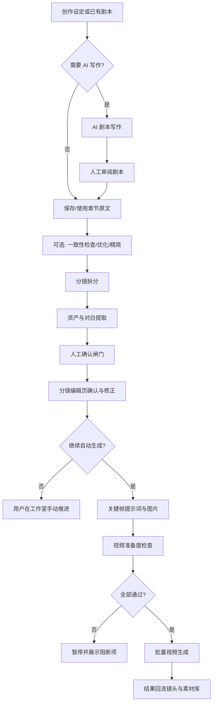
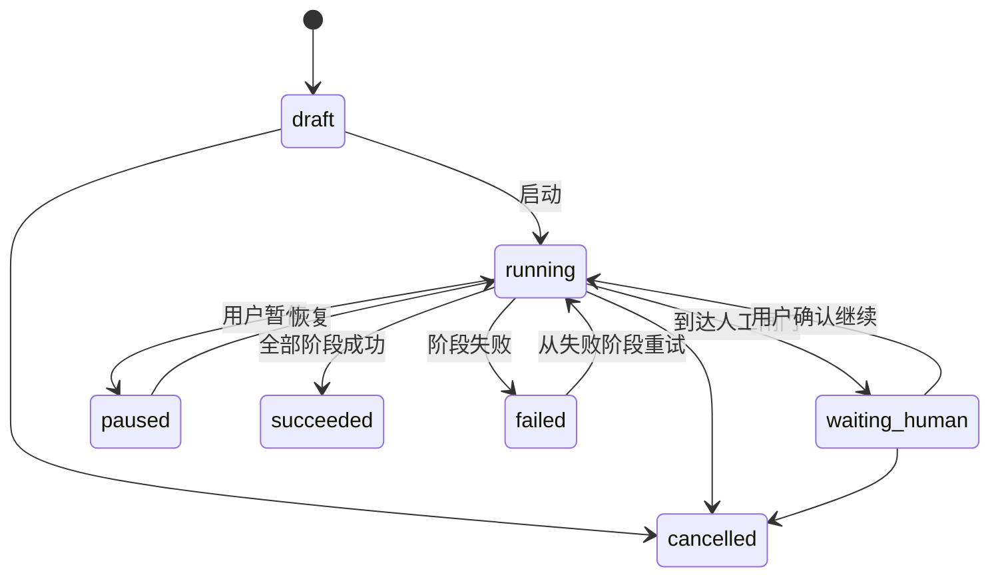
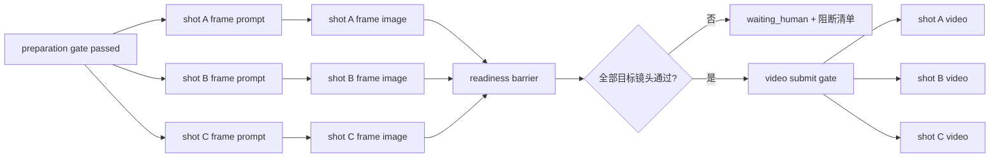

> 本文是待实施方案，不代表当前系统已经具备 AI 剧本写作或跨阶段自动编排能力。当前真实能力与边界以[产品概览](/docs/architecture/product-overview/)、[默认模型解析](/docs/architecture/llm-default-model-resolution/)和[任务执行架构](/docs/architecture/task-execution/)为准。

配套研发文档：

- [详细技术设计](/docs/plans/ai-script-production-technical-design/)
- [测试用例与发布门禁](/docs/plans/ai-script-production-test-plan/)
- [开发计划](/docs/plans/ai-script-production-development-plan/)

## 1. 背景与目标

元风当前已经具备“已有章节剧本 → 分镜拆分 → 资产/对白提取 → 人工确认 → 关键帧与视频生成”的主体链路，但各步骤需要用户分别触发，且系统没有从创作意图生成完整剧本的入口。

本方案新增两类能力：

1. **AI 剧本写作**：从题材、人物、世界观、集数、时长与创作要求生成可编辑章节剧本。
2. **章节自动生产工作流**：按配置自动执行剧本处理、分镜拆分、信息提取和可选的生成步骤，并在会影响内容正确性的节点暂停等待人工确认。

目标不是实现“无人值守一键成片”，而是：

- 自动完成可重复、可验证的步骤；
- 在高风险步骤设置明确人工闸门；
- 所有步骤可追踪、可暂停、可恢复、可重试；
- 文本、图片、视频统一复用“模型管理 → 系统设置”中的默认模型；
- 不破坏分镜编辑页、分镜工作室和任务中心的既有职责。

### 1.1 重新审视后的关键优化

为了让方案真正建立在现有功能之上，而不是在旁边再造一套生产系统，设计进一步收敛为以下结论：

1. **工作流是编排真相，不是新的执行器集合**：除 `script_write` 外，各阶段必须调用已有 task service 和 executor。
2. **后半段不是线性步骤，而是按镜头展开的 DAG**：帧提示词、帧图和视频需要 fan-out / barrier / fan-in，不能只靠一个 `current_stage` 和 JSON 摘要可靠恢复。
3. **步骤与步骤项从 MVP 起就结构化持久化**：章节级步骤使用 `RunStep`，镜头级批量项使用 `RunStepItem`，支持部分成功和定向重试。
4. **内部推进不进入用户任务中心**：推进器是轻量内部调度动作，不创建一个长期占用 Worker 的“父 GenerationTask”。
5. **现有 API 不被工作流内部调用**：Orchestrator 调用 service；若某项创建逻辑仍留在 route，实施前先下沉为可复用 service。
6. **必须提供对账恢复**：除任务完成时推进外，增加定时 reconciliation，修复 Worker 重启或回调丢失后停滞的 run。
7. **AI 写作与生产编排分开交付**：写作先成为可独立使用的章节能力，确认可用后再接入自动流程。

## 2. 产品原则

### 2.1 人机协作优先

AI 写作、拆分和提取都属于建议性产出。工作流不得绕过分镜编辑页直接把未经确认的候选用于批量视频生成。

### 2.2 模型配置单一来源

默认模型继续由 `model_settings` 单例维护：

```text
default_text_model_id
default_image_model_id
default_video_model_id
```

工作流默认不保存重复的模型 ID，也不新增独立“工作流模型设置”。每一步在执行时按模型类别解析系统默认模型。

### 2.3 状态语义分离

工作流状态、子任务状态、镜头确认状态和视频准备度必须分别建模：

| 状态 | 权威来源 | 负责表达 |
| --- | --- | --- |
| 工作流运行状态 | `ChapterProductionRun` | 当前处于哪个阶段、是否暂停或失败。 |
| 子任务运行状态 | `GenerationTask` | 单个 LLM、图片或视频任务的排队、执行与结果。 |
| 镜头信息确认 | `shot.status` | 提取候选是否完成确认。 |
| 视频准备度 | `ShotVideoReadinessRead` | 镜头是否具备视频生成条件。 |

工作流不得写入 `shot.status=generating`，也不得使用 `ChapterStatus` 表达细粒度执行阶段。

### 2.4 可恢复而非长事务

每一个阶段都应独立提交产物。工作流失败后从最近成功阶段恢复，不能依赖一个跨越多个 AI 调用和数据库操作的长事务。

## 3. 用户场景

### 3.1 从创作设定生成新剧本

用户提供：

- 题材与受众；
- 核心创意或一句话梗概；
- 世界观与时代背景；
- 主要人物及关系；
- 目标集数、单集时长、节奏和画面形式；
- 禁止内容、品牌约束和额外要求。

系统生成：

- 项目级故事梗概；
- 人物设定建议；
- 分集大纲；
- 指定章节的标题、摘要和完整剧本正文；
- 写作假设与需要人工确认的问题。

用户可以保存为章节原文、局部改写或放弃结果。

### 3.2 对已有剧本启动自动准备

用户已有 `Chapter.raw_text`，选择自动执行：

```text
一致性检查（可选）
→ 优化/精简（可选）
→ 分镜拆分
→ 资产与对白提取
→ 人工确认闸门
```

工作流到达人工闸门后暂停，并将用户引导到分镜编辑页。

### 3.3 确认后继续自动生成

用户完成候选确认并显式点击“继续自动生产”后，可选执行：

```text
关键帧提示词
→ 关键帧图片
→ 视频准备度检查
→ 视频生成
```

任何不满足准备度的镜头应被标记为阻断项，而不是静默跳过或强制提交。

## 4. 目标流程



### 4.1 与现有功能的复用矩阵

工作流节点与当前实现的对应关系必须在开发前固定，避免重复实现：

| 工作流节点 | 现有能力 | 复用方式 | 需要新增/调整 |
| --- | --- | --- | --- |
| 剧本写作 | 无 | 不适用 | 新增 `ScriptWriterAgent`、写作任务与结果应用。 |
| 一致性检查 | `create_consistency_task` + `script_consistency` executor | Orchestrator 调 task service | task payload 增加可选 `production_run_id/step_id`。 |
| 剧本优化 | `create_script_optimization_task` + `script_optimize` executor | 同上 | 明确优化结果是否自动应用，默认进入剧本确认闸门。 |
| 剧本精简 | `create_script_simplification_task` + `script_simplify` executor | 同上 | 避免优化、精简无条件串联；由 preset 选择其一或指定顺序。 |
| 分镜拆分 | `create_divide_task` + `script_divide` executor | 同上 | 已有镜头时默认阻断，禁止隐式覆盖。 |
| 信息提取 | `create_extract_task` + `script_extract` executor | 同上 | 完成后进入人工确认闸门，不自动标记全部镜头可生成。 |
| 候选确认 | 分镜编辑页、preparation-state、候选 mutation API | 继续由用户操作 | 新增 run gate 检查与“确认后继续”动作。 |
| 帧提示词 | `shot_frame_prompt` executor | 按镜头创建已有任务 | 创建逻辑下沉/复用为 service，并关联 `RunStepItem`。 |
| 帧图生成 | `create_image_task_and_link`、`image_generation` executor | 按镜头创建已有任务 | 由 preset 明确首帧/关键帧/尾帧策略。 |
| 视频准备度 | `/{shot_id}/video-readiness` 对应 service | Orchestrator 直接调用 service | 新增章节级聚合，不通过 HTTP 自调用。 |
| 视频生成 | `video_generation` executor 与结果回流 | 按镜头创建已有任务 | 将 route 中任务创建编排下沉为可复用 service。 |
| 任务追踪 | GenerationTask、GenerationTaskLink、任务中心 | 保持不变 | link 增加 run/step 元数据，但任务中心仍展示子任务。 |

### 4.2 工作流预设而非任意节点编辑

MVP 提供固定预设，后端将其展开为版本化 manifest：

| preset | 展开阶段 |
| --- | --- |
| `script_assist` | write → script review gate |
| `prepare_shots` | optional text polish → divide → extract → preparation gate |
| `prepare_frames` | prepare_shots → frame prompt → frame image → readiness barrier |
| `controlled_video` | prepare_frames → video submit gate → video generation |

运行记录保存 `manifest_version` 与展开后的阶段快照。后续修改预设不会改变已启动运行的步骤图。

## 5. AI 剧本写作设计

### 5.1 写作模式

| 模式 | 输入 | 输出 |
| --- | --- | --- |
| 从零创作 | 创意、题材、人物、集数与约束 | 故事梗概、分集大纲和目标章节正文。 |
| 按大纲写章节 | 已有项目设定、分集大纲、章节序号 | 章节标题、摘要、正文和连续性说明。 |
| 续写 | 前文、当前人物状态、下一阶段目标 | 保持连续性的后续章节。 |
| 改写 | 原文、修改目标与保留项 | 修改后的正文及变更摘要。 |
| 扩写/压缩 | 原文、目标时长或字数 | 保持剧情核心的扩写或精简版本。 |

### 5.2 写作输入契约草案

```text
ScriptWriteRequest
├─ mode
├─ project_id
├─ chapter_id? 
├─ premise
├─ genre
├─ audience
├─ visual_style
├─ episode_count?
├─ target_duration_seconds?
├─ target_length?
├─ characters[]
├─ world_setting?
├─ previous_context?
├─ must_include[]
├─ must_avoid[]
└─ additional_instructions?
```

输入应尽量引用项目和资产实体，而不是在请求中复制完整角色资料。Service 层负责组装项目、章节、角色和风格上下文。

### 5.3 写作输出契约草案

```text
ScriptWriteResult
├─ title
├─ summary
├─ script_text
├─ episode_outline[]
├─ character_notes[]
├─ continuity_notes[]
├─ assumptions[]
└─ review_questions[]
```

`script_text` 只有在用户确认或工作流配置允许自动应用时，才写入 `Chapter.raw_text`。生成结果先保存到 `GenerationTask.result`，避免未确认内容直接覆盖原文。

### 5.4 Agent 与模型

新增逻辑 Agent：

```text
ScriptWriterAgent
```

职责：

- 将创作设定组织成剧本结构；
- 保持角色动机与章节连续性；
- 输出结构化结果；
- 明确列出假设与待确认问题。

模型解析：

```text
ScriptWriterAgent
  → build_default_text_llm / build_default_text_llm_sync
  → ModelSettings.default_text_model_id
```

不从 Agent 管理页读取模型，也不在写作表单重复配置模型。

## 6. 自动工作流领域模型

### 6.1 `ChapterProductionRun`

章节级生产运行是编排状态的唯一真相。

| 字段 | 类型建议 | 说明 |
| --- | --- | --- |
| `id` | string | 运行 ID。 |
| `project_id` | string | 项目归属。 |
| `chapter_id` | string | 章节归属。 |
| `status` | enum | 总体运行状态。 |
| `current_stage` | enum | 当前或待执行阶段。 |
| `manifest_version` | string | 工作流预设和阶段图版本。 |
| `config` | JSON | 启用阶段、闸门和批量策略的运行快照。 |
| `input_snapshot` | JSON | 启动时的创作输入和关键实体版本摘要。 |
| `stage_outputs` | JSON | 阶段与 `task_id`、产物引用的映射。 |
| `error_code` | string? | 标准化错误分类。 |
| `error_message` | string? | 用户可读失败摘要。 |
| `cancel_requested` | bool | 是否请求取消。 |
| `created_at` / `updated_at` | datetime | 审计时间。 |
| `started_at` / `finished_at` | datetime? | 运行指标。 |

### 6.2 运行状态

```text
draft
running
waiting_human
paused
succeeded
failed
cancelled
```

状态转换：



### 6.3 阶段枚举

```text
script_write
script_review_gate
script_consistency
script_optimize
script_simplify
script_divide
script_extract
human_preparation_gate
frame_prompt
frame_image
video_readiness
video_generation
completed
```

并非每次运行都执行所有阶段。`config` 保存本次运行启用的阶段与顺序快照，确保后续系统默认值变化不会改写已经开始的运行计划。

### 6.4 从 MVP 起持久化步骤和镜头项

原方案将步骤子表列为可选项，但这不足以可靠承接现有批量生成能力。章节前半段是线性的，帧图和视频阶段则按镜头展开，必然出现“部分成功、部分失败、单项重试”。因此 MVP 起采用三层结构：

```text
ChapterProductionRun
  └─ ChapterProductionRunStep
       └─ ChapterProductionRunStepItem（仅 fan-out 阶段使用）
```

`ChapterProductionRunStep`：

| 字段 | 说明 |
| --- | --- |
| `id` / `run_id` | 步骤及所属运行。 |
| `stage_key` / `sequence` | 阶段标识和显示顺序。 |
| `status` | pending/running/waiting/partial/succeeded/failed/skipped/cancelled。 |
| `attempt` | 当前阶段整体重试次数。 |
| `generation_task_id` | 线性单任务阶段的任务 ID。 |
| `input_snapshot` / `output_summary` | 可解释且不含密钥的阶段摘要。 |
| `started_at` / `finished_at` | 阶段耗时。 |

`ChapterProductionRunStepItem`：

| 字段 | 说明 |
| --- | --- |
| `id` / `step_id` | 项及所属步骤。 |
| `entity_type` / `entity_id` | 通常为 `shot` 和 shot ID。 |
| `status` | 单镜头执行状态。 |
| `attempt` | 单项重试次数。 |
| `generation_task_id` | 对应现有 GenerationTask。 |
| `blocked_reasons` | readiness 或前置条件阻断摘要。 |
| `output_ref` | 帧图、视频或文件引用。 |

`stage_outputs` 仅保留面向读取的聚合缓存，不再作为步骤执行真相。

### 6.5 后半段 DAG 与 barrier

章节级线性步骤结束后，工作流按启动时冻结的 shot ID 集合展开：



- barrier 只在所有非跳过 item 到达终态后结算；
- `partial` 不等于失败，用户可以重试失败项或从目标集合排除；
- 新增镜头不会自动加入已经启动的 run，避免目标漂移；
- 删除目标镜头时，将对应 item 标记为 skipped 并记录原因。

## 7. 编排机制

### 7.1 推荐：阶段驱动的短任务编排

不建议由一个 Celery 任务持续轮询全部子任务。推荐：

1. `ProductionRunService` 根据 manifest 找到可执行 step；
2. 对线性 step 创建一个现有 `GenerationTask`，对 fan-out step 创建多个 `StepItem + GenerationTask`；
3. 现有 executor 在终态写回完成后，调用统一 `notify_task_terminal(task_id)`；
4. `ProductionRunTransitionService` 结算 step 或 barrier，并派发下一批可执行项；
5. 到人工闸门时将 run/step 设为 waiting，不再派发；
6. 周期性 reconciliation 扫描“子任务已终态但 step 未结算”的异常运行。

优势：

- Worker 重启不会丢失整个流程；
- 每一步均可单独重试；
- GenerationTask 继续作为执行状态真相；
- 避免长时间占用单并发 Celery Worker。
- 任务完成通知丢失时仍可通过对账恢复。

### 7.2 执行链路

```text
ChapterProductionRunOrchestrator
  → 解析 manifest 与可运行步骤
  → StageAdapter.preflight(...)
  → StageAdapter.create_tasks(...)
  → GenerationTaskLink + RunStep/RunStepItem
  → task.execute(task_id)
  → 现有 executor generate + apply
  → notify_task_terminal(task_id)
  → 结算 step/barrier 并推进
```

### 7.3 StageAdapter：工作流与现有能力之间的唯一适配层

每个工作流阶段实现统一接口，但不重新实现业务逻辑：

```text
StageAdapter
├─ preflight(context) -> PreflightResult
├─ resolve_targets(context) -> entity refs
├─ create_tasks(context, targets) -> GenerationTask refs
├─ inspect_terminal_results(context) -> StageResult
└─ apply_transition(context, result) -> next action
```

Adapter 内只能调用现有 service，不能：

- 从编排器发起内部 HTTP 请求；
- 复制 route 中的任务创建逻辑；
- 自行调用 provider；
- 绕过 GenerationTask 直接执行长任务。

首批 adapter：

```text
ScriptWriteStageAdapter（新增能力）
ScriptConsistencyStageAdapter
ScriptOptimizeStageAdapter
ScriptSimplifyStageAdapter
ScriptDivideStageAdapter
ScriptExtractStageAdapter
PreparationGateStageAdapter
FramePromptStageAdapter
FrameImageStageAdapter
VideoReadinessBarrierAdapter
VideoSubmitGateStageAdapter
VideoGenerationStageAdapter
```

### 7.4 新增任务类型

| `task_kind` | 用途 | 模型类别 |
| --- | --- | --- |
| `script_write` | 生成或改写剧本。 | text |

其他阶段复用现有：

- `script_consistency`
- `script_optimize`
- `script_simplify`
- `script_divide`
- `script_extract`
- `shot_frame_prompt`
- `image_generation`
- `video_generation`

工作流推进不创建面向用户的 `GenerationTask`。它是短时 service/Celery 内部调度动作，避免任务中心出现没有业务产物的 `chapter_production_advance`。

### 7.5 完成通知与对账恢复

`notify_task_terminal` 应接在任务状态最终提交之后，并保持幂等：

```text
GenerationTask terminal commit
  → 根据 task link 查找 run step/item
  → 乐观锁/行锁结算 item
  → 若 barrier 满足则结算 step
  → 推进下一个 step
```

Reconciler 定时处理：

- run 为 running，但超过阈值没有活跃 GenerationTask；
- step/item 为 running，但关联 task 已终态；
- 任务已取消，但 run 未推进到 paused/cancelled/partial；
- Worker 重启后未发出的下一阶段。

同一 `run_id + step_id + transition_version` 只允许推进一次。

### 7.6 并发与去重

- 同一章节默认只允许一个活跃的 `ChapterProductionRun`。
- 创建阶段任务前，按 `relation_type + relation_entity_id + task_kind` 检查活跃任务。
- 批量生成阶段按镜头创建子任务，但由 run 记录目标镜头集合。
- 用户手动发起的任务若与工作流阶段冲突，应在启动前返回明确冲突信息。
- 1 vCPU / 单 Celery Worker 部署默认每次只派发一个重型生成 item；并发策略是部署配置，不写死在工作流定义中。

### 7.7 取消、暂停与恢复

| 操作 | 行为 |
| --- | --- |
| 暂停 | 不再派发下一阶段；当前 provider 调用可继续到安全边界。 |
| 取消 | 标记 run 取消，并向当前子任务发出 best-effort 取消。 |
| 恢复 | 重新执行 preflight，从 `current_stage` 继续。 |
| 重试 | 新建该阶段的 GenerationTask，不覆盖之前的失败任务记录。 |

### 7.8 人工闸门的可验证解除条件

闸门不是一个可随意点击的“继续”按钮。后端必须重新计算条件：

| 闸门 | 必须满足 |
| --- | --- |
| `script_review_gate` | 写作结果已被显式应用到章节，且 `Chapter.updated_at` 与 run 记录的已确认版本一致。 |
| `human_preparation_gate` | 目标镜头均通过现有 preparation-state 规则；所有候选已处理或镜头显式跳过提取。 |
| `video_submit_gate` | 目标镜头逐项通过最新 video-readiness，用户确认本次模型、镜头数与生成范围。 |

解除闸门时保存：

- 确认人（当前单管理员阶段记录 `Admin`）；
- 确认时间；
- 被确认实体及版本摘要；
- 下一阶段目标集合；
- 使用的 preset 与关键参数。

若实体在确认后、下一阶段派发前又被修改，preflight 应让闸门失效并要求重新确认。

## 8. 系统模型设置复用

### 8.1 分类映射

| 工作流阶段 | 默认模型来源 |
| --- | --- |
| 写作、检查、优化、精简、拆分、提取、帧提示词 | `default_text_model_id` |
| 演员/角色/场景/道具/服装/帧图生成 | `default_image_model_id` |
| 视频生成 | `default_video_model_id` |

### 8.2 启动前检查

工作流启动时根据启用阶段检查所需类别：

```text
只写剧本 → text
准备到分镜 → text
准备到关键帧 → text + image
准备到视频 → text + image + video
```

若默认模型缺失、类别不匹配、Provider 被禁用或缺少 API Key：

- 返回结构化 preflight 错误；
- 不创建运行或将运行保留为 `draft`；
- 前端提供“前往模型设置”入口；
- 不在工作流页面增加临时模型选择作为绕过方式。

### 8.3 模型配置变更语义

建议记录每个阶段真正解析到的：

- model ID；
- provider ID；
- 模型名称；
- 关键能力快照。

这样系统默认模型改变后，历史任务仍可解释。但新阶段开始时应使用最新系统默认模型，除非运行配置明确采用“启动时锁定模型”策略。

MVP 推荐：

- 创建 run 时检查 manifest 涉及的全部模型类别；
- 每个阶段派发前再次检查当前类别，防止运行期间 Provider 被禁用；
- 每个阶段执行时解析当前默认模型；
- GenerationTask payload 记录实际解析结果。

模型设置是默认值来源，不等于忽略供应商能力。图片与视频阶段还必须复用现有 generation options 和 capability 校验，不能只检查 category。

## 9. API 草案

### 9.1 单步剧本写作

```text
POST /api/v1/script-processing/write-script-async
GET  /api/v1/film/tasks/{task_id}/status
GET  /api/v1/film/tasks/{task_id}/result
```

创建任务返回沿用 `AsyncTaskCreateRead`。

### 9.2 章节生产运行

```text
POST /api/v1/studio/chapters/{chapter_id}/production-runs
GET  /api/v1/studio/chapters/{chapter_id}/production-runs
GET  /api/v1/studio/production-runs/{run_id}
POST /api/v1/studio/production-runs/{run_id}/start
POST /api/v1/studio/production-runs/{run_id}/pause
POST /api/v1/studio/production-runs/{run_id}/resume
POST /api/v1/studio/production-runs/{run_id}/steps/{step_id}/confirm
POST /api/v1/studio/production-runs/{run_id}/steps/{step_id}/retry
POST /api/v1/studio/production-runs/{run_id}/steps/{step_id}/items/{item_id}/retry
POST /api/v1/studio/production-runs/{run_id}/steps/{step_id}/items/{item_id}/skip
POST /api/v1/studio/production-runs/{run_id}/cancel
```

`resume` 只恢复用户主动暂停的运行；人工闸门必须通过 `confirm`，不能用通用 resume 绕过条件校验。

### 9.3 应用剧本结果

```text
POST /api/v1/studio/chapters/{chapter_id}/apply-script-task-result
```

请求至少包含：

- `task_id`
- `target_field`: `raw_text` 或 `condensed_text`
- `expected_chapter_updated_at`

通过乐观并发字段避免 AI 结果覆盖用户在任务运行期间完成的编辑。

### 9.4 响应要求

- 统一使用 `ApiResponse<T>`。
- 新 API 进入 OpenAPI，并由前端 generated client 调用。
- API 层只处理参数、鉴权与响应；编排规则放在 studio service。
- 工作流详情可包含子任务摘要，但不复制完整任务结果。
- 所有 mutation 接受 `expected_updated_at` 或版本号，避免重复点击和并发推进。

## 10. 页面与交互方案

### 10.1 入口分布

| 页面 | 新入口 | 职责 |
| --- | --- | --- |
| 项目工作台 · 章节 Tab | “AI 写剧本”“自动生产” | 创建写作任务或章节生产运行。 |
| 章节原文弹窗 | 写作、续写、改写、扩写、压缩 | 审阅并应用 AI 文本结果。 |
| 生产运行抽屉 | 阶段时间线、错误、暂停、恢复、取消 | 承载业务编排详情。 |
| 分镜编辑页 | “完成确认并继续自动生产” | 解除人工准备闸门。 |
| 分镜工作室 | 自动生成状态与阻断清单 | 承担生成阶段与结果查看。 |
| 任务中心 | 子任务状态与回跳 | 保持轻量，不展示完整工作流上下文。 |

### 10.2 AI 写作向导

推荐四步：

```text
1. 创作目标
2. 世界观与人物
3. 篇幅、风格与约束
4. 检查模型与生成
```

生成后采用左右对照：

- 左侧：输入设定与上下文摘要；
- 右侧：生成正文；
- 底部：应用为原文、继续改写、复制、放弃。

应用操作必须显示“将覆盖哪个字段”，并在章节已被修改时要求重新确认。

### 10.3 生产运行抽屉

展示内容：

- 总体状态与当前阶段；
- 已完成、进行中、等待人工和被跳过阶段；
- 当前阶段的开始时间、耗时和关联任务；
- 失败原因与可执行恢复动作；
- 人工闸门的明确说明；
- 使用的默认模型类别与实际模型名称。

不展示：

- 大段原始 prompt；
- provider 原始响应；
- 每个镜头的完整业务详情。

这些内容仍留在剧本编辑、分镜编辑和工作室。

### 10.4 自动化等级

| 等级 | 自动执行范围 | 人工闸门 |
| --- | --- | --- |
| 辅助写作 | 只生成剧本候选。 | 应用剧本前。 |
| 自动准备 | 写作/处理 → 拆分 → 提取。 | 应用剧本、候选确认。 |
| 自动生成准备 | 自动准备 + 帧提示词/关键帧。 | 候选确认、批量生成确认。 |
| 受控全流程 | 自动准备 + 生成准备 + 视频。 | 剧本确认、候选确认、视频提交。 |

即使选择最高等级，也不能取消剧本与候选确认两个核心闸门。

## 11. 错误与恢复

| 错误 | 处理 |
| --- | --- |
| 默认模型未配置 | 保留 draft，链接到模型设置。 |
| Provider 不可用 | 当前阶段失败，可在修复配置后重试。 |
| 剧本在任务期间被编辑 | 不自动覆盖，要求用户比较并应用。 |
| 拆分已存在镜头 | 启动前询问覆盖、追加或取消；默认不破坏已有镜头。 |
| 提取部分失败 | 保留已成功镜头，显示失败集合并允许定向重试。 |
| 部分镜头 readiness 不通过 | 工作流暂停，展示阻断项并链接到工作室。 |
| 父运行取消 | 停止派发新任务，并 best-effort 取消活跃子任务。 |

## 12. 安全、成本与可观测性

### 12.1 安全

- 所有 API 受现有管理员 Session 保护。
- 不把 Provider Key 写入工作流 config、task result 或前端响应。
- 用户输入和模型输出按现有内容安全策略处理。
- 原始 prompt 与 provider 调试数据只在受控诊断界面提供。

### 12.2 成本控制

- 启动前展示预计执行阶段和目标镜头数量。
- 批量图片/视频前再次确认。
- 限制单次目标镜头数量与并发。
- 记录实际模型、调用次数、生成数量和耗时；成本字段在供应商可提供时记录。

### 12.3 指标

建议记录：

- 写作任务成功率与平均耗时；
- AI 剧本被应用的比例；
- 各阶段成功率、重试率和平均耗时；
- 人工闸门停留时长；
- 从写作到首个视频成功的闭环时长；
- readiness 阻断原因分布；
- 文本、图片、视频模型的实际使用分布。

## 13. 分阶段实施

### Phase 1：AI 写作单步能力

- `ScriptWriterAgent`
- `script_write` GenerationTask
- 写作/续写/改写 API
- 章节原文弹窗中的写作向导
- 结果预览、乐观并发与显式应用
- 默认文本模型 preflight

**完成标准**：用户能从设定生成剧本候选，审阅后安全写入章节；任务可追踪、取消和重试。

### Phase 2：前半段自动准备

- `ChapterProductionRun`、`RunStep` 与 transition service
- 写作/检查/优化/精简/拆分/提取阶段编排
- 生产运行抽屉
- 人工准备闸门
- 暂停、恢复、取消和阶段重试
- task terminal 通知与 reconciliation

实施前置：将仍位于 route 的任务创建逻辑下沉为 service，并为现有 task service 增加可选 run/step 关联参数。

**完成标准**：运行可在 Worker 重启后恢复，到候选确认时稳定暂停，不改变页面职责。

### Phase 3：确认后的生成准备

- `RunStepItem` 与按镜头 fan-out / barrier
- 帧提示词与关键帧批量阶段
- video-readiness 聚合检查
- 阻断清单与精确回跳
- 系统默认图片/视频模型 preflight

**完成标准**：确认后的镜头可自动准备到可生成状态，未通过镜头不会被错误提交。

### Phase 4：受控视频生成与运营指标

- 视频批量提交确认
- 父运行与子任务关联视图
- 成本、耗时和失败分类指标
- 工作流模板与运行历史

**完成标准**：批量生成可控、可审计、可恢复，任务中心仍保持轻量。

## 14. 验收矩阵

| 领域 | 验收要求 |
| --- | --- |
| 模型 | 所有阶段默认使用系统模型设置；缺失配置时不启动。 |
| 状态 | 工作流、任务、镜头确认和 readiness 无语义混用。 |
| 数据 | AI 结果不会静默覆盖用户更新；阶段产物可追踪。 |
| 编排 | Worker 重启后可恢复；失败阶段可单独重试。 |
| 批量 | 单镜头失败不抹掉成功项；可定向重试、跳过并重新结算 barrier。 |
| 页面 | 准备页继续负责确认，工作室继续负责生成。 |
| 任务中心 | 只展示轻量任务信息和业务回跳。 |
| API | 全部进入 OpenAPI，前端使用 generated client。 |
| 安全 | Session 鉴权生效，Provider Key 不进入业务响应。 |
| 验证 | 后端测试、Pylint、前端类型检查和关键流程冒烟通过。 |

## 15. 明确不做

- MVP 不提供任意拖拽节点的通用工作流编辑器。
- 不允许用户在每个节点随意输入 provider 原始参数。
- 不将 Agent 管理 mock 页面作为生产编排入口。
- 不在任务中心展示完整剧本、提示词或镜头映射。
- 不自动跳过剧本审阅与候选确认闸门。
- 不在同一个数据库事务中执行整个生产流程。

## 16. 待确认产品决策

实施前需要确定：

1. AI 写作是优先生成“单章正文”，还是先生成“整季大纲 + 单章正文”？
2. 写作结果默认应用到 `raw_text`，还是必须由用户选择原文/精简文本？
3. 已存在镜头时重新运行拆分采用覆盖、追加还是新建版本？
4. 自动生成阶段是否默认止于关键帧，视频提交是否始终需要二次确认？
5. 工作流默认使用执行时最新模型，还是启动时锁定模型快照？
6. 是否需要项目级工作流模板，还是先只提供固定的四档自动化等级？

MVP 推荐答案：

- 先生成整季大纲，再按需生成单章正文；
- 结果默认只进入预览，用户显式选择应用位置；
- 已存在镜头默认禁止覆盖；
- 默认止于关键帧，视频提交必须确认；
- 阶段执行时使用最新系统默认模型，并记录实际模型；
- 先提供固定自动化等级，不建设通用编辑器。
