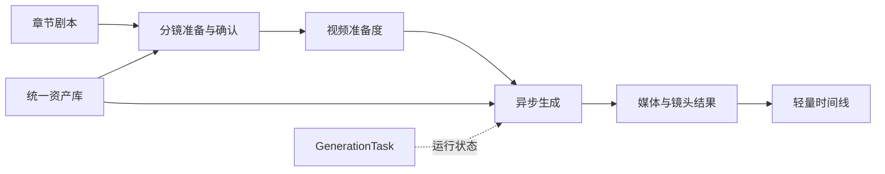
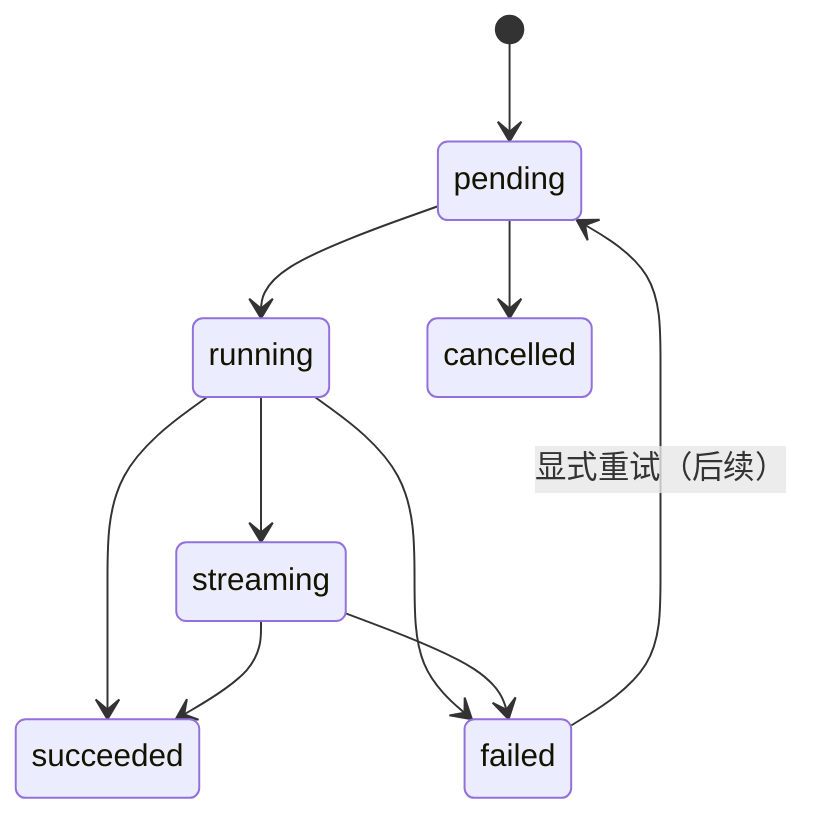

> 本文描述仍在推进的目标方案。当前已生效的实现请以[产品概览](/docs/architecture/product-overview/)、[任务执行架构](/docs/architecture/task-execution/)和[生成工作台架构](/docs/architecture/generation-workspace/)为准。

## 1. 方案目标

在不混淆现有页面职责的前提下，建立可持续演进的 AI 短剧生产闭环：



目标不是重新发明独立的工作流引擎，而是收敛已有对象、接口和前端状态，使生产节点、失败恢复和结果归属可被稳定理解。

## 2. 目标分层

| 层 | 职责 | 设计约束 |
| --- | --- | --- |
| 前端页面 | 展示上下文、收集输入、引导下一步和呈现状态。 | 新接口使用 OpenAPI generated client；页面不推断后端真相。 |
| API | 参数校验、鉴权（后续）、响应组织。 | 不承载跨实体业务编排。 |
| Service | 状态流转、实体校验、准备度计算和任务创建。 | 同一状态规则只能有一个权威实现。 |
| Contracts | 生成输入/输出、供应商能力、任务 DTO。 | 位于 `app/core/contracts`，不依赖 tasks。 |
| Tasks / Worker | 持久化任务领取、执行、进度和结果回写。 | Celery 是执行器，`GenerationTask` 才是状态真相。 |
| Integrations | 将标准生成契约转换为供应商请求与结果。 | 不依赖任务类型，实现 provider 能力差异。 |

## 3. 关键流程设计

### 3.1 章节到可生成镜头

```text
录入/修订章节原文
  → divide / extract 异步任务
  → 创建镜头、候选资产和候选对白
  → 编辑页确认、关联、忽略或修正
  → 服务端统一计算 shot.status
  → 编辑页引导到工作室
  → 工作室检查 video-readiness
```

#### 规则

- 只有编辑页承担主要的候选确认；工作室只提供诊断与回跳。
- `shot.status` 仅存储 `pending` 与 `ready` 的确认语义。
- `ready` 不等于视频可提交；视频准备度还需要检查关键帧、提示词、模型、时长、参考模式和运行任务。
- 服务端负责状态计算；前端只能展示或请求刷新，不能在本地写入推断状态。

### 3.2 生成草稿到供应商提交

生成域采用统一的四层模型：

```text
Base Draft → Context → Derived Preview → Submission Payload
```

| 层 | 责任 | 不可变要求 |
| --- | --- | --- |
| Base Draft | 用户可编辑的比例、时长、提示词、参考图等输入。 | 不混入供应商字段。 |
| Context | 项目、镜头、资产、模板和默认模型。 | 从后端或权威实体读取。 |
| Derived Preview | 可视化提示词、校验结果和预计 payload。 | 可解释、可刷新、不应成为新的持久化真相。 |
| Submission Payload | 已解析 provider/model 能力后的提交参数。 | 由 contracts + integrations 生成，记录在任务 payload。 |

图片帧、视频与资产图片应复用该模式。剧本处理和分镜候选确认不强行接入，避免把不同职责抽象成一个“生成表单”。

### 3.3 异步任务与恢复



| 场景 | 方案 |
| --- | --- |
| 创建任务 | 先持久化 GenerationTask 与业务关联，再派发执行。 |
| 轮询 | 前端只读取任务 API，不直接读取 Celery。 |
| 取消 | 记录取消请求并尝试终止执行；界面标注 best-effort。 |
| 失败 | 保存标准化错误和可安全展示的诊断摘要；在原业务页提供修复/重试入口。 |
| 结果回流 | 将文件或 provider 结果写回镜头、帧图或资产，并让任务中心仅提供回跳。 |

## 4. 接口与数据收敛

### 4.1 API 契约

| 主题 | 目标方案 | 验证 |
| --- | --- | --- |
| 响应壳 | 统一 `code`、`message`、`data`、`meta`。 | API 响应测试和 OpenAPI 快照。 |
| 前端调用 | 所有主路径走 generated client。 | 禁止为新增 API 编写手写 service。 |
| 状态 DTO | 准备状态、视频准备度、runtime summary 分开建模。 | 前端不以一个 Tag 代替三类状态。 |
| 错误 | 错误码与可读 message 保持一致，页面保留可恢复动作。 | 失败场景端到端测试。 |

### 4.2 数据模型治理

优先保持以下边界，而不是立即大规模重建表结构：

- `Project → Chapter → Shot` 是叙事生产主线。
- `Character` 是项目角色组合，不能和 `Actor` 混为同一实体。
- `GenerationTask` 是任务状态真相，`GenerationTaskLink` 表达业务归属。
- `FileItem` 存媒体对象，业务表只存引用和用途，不复制媒体元数据。
- 任何新增“状态”前，先确定它属于确认、准备度还是运行时。

涉及数据库变更时，应提供迁移、回滚策略和 SQLite 开发环境验证；不能仅依赖启动时 `create_all`。

## 5. 页面与交互落地

| 页面域 | 目标交付 | 不可突破的边界 |
| --- | --- | --- |
| 项目大厅/工作台 | 明确阶段进度与下一动作，减少入口选择成本。 | 不把章节生产细节塞进列表卡片。 |
| 分镜编辑页 | 将候选、修正、确认和 `ready` 原因组织成可批量处理的准备流。 | 不承担视频生成表单。 |
| 分镜工作室 | 以准备度、关键帧和生成结果为主视图，支持诊断回跳。 | 不成为新的候选确认主入口。 |
| 资产页 | 促进复用、追踪关联和图片生成。 | 不自行推断镜头准备状态。 |
| 任务中心 | 统一进度、失败和回跳。 | 不显示提示词或业务细节大段内容。 |

完整视觉和交互要求见[UI 设计规范](/docs/plans/ui-design-spec/)。

## 6. 分阶段交付

### 阶段 A：契约与可运行性治理（P0）

- 收敛遗留手写 API 调用，补齐 OpenAPI 生成链路。
- 为状态转换、任务回流和响应壳补充测试。
- 建立本地一键预检：依赖、数据库、后端健康检查、前端构建和任务 Worker 检查。
- 统一开发/部署环境变量、CORS 与对象存储连通性验证。

**完成标准**：新开发环境可按文档启动；主 API 和前端类型检查通过；任务状态不会依赖 Celery 查询。

### 阶段 B：准备与生成体验（P1）

- 将候选确认的待处理原因、批量动作和回退动作可视化。
- 统一页面级加载、错误、空状态和重试模式。
- 将工作室准备度诊断变为可执行清单，提供精确回跳。
- 为任务失败提供上下文内的修复和重试入口。

**完成标准**：用户不需要猜测“下一步在哪”或“为什么不能生成”。

### 阶段 C：质量与可观测性（P1）

- 记录任务时长、失败分类、准备通过率和资产复用率。
- 固化 provider 能力矩阵与生成参数校验。
- 系统化治理 Agent 提示词、输入上下文和输出质量。

**完成标准**：运营可基于真实数据定位失败、瓶颈和质量问题。

### 阶段 D：协作与轻量后期（P2）

- 引入认证、项目成员和最小权限模型。
- 完善时间线、素材检查和导出前校验。
- 对 Agent 管理页选择真实产品化或下线遗留入口。

**完成标准**：协作能力不破坏单用户主链路，剪辑仍保持轻量边界。

## 7. 验证矩阵

| 变更类型 | 最低验证 |
| --- | --- |
| 后端状态/服务 | 定向 pytest、`pylint app`、必要的任务和数据库测试。 |
| API/Schema | 更新 OpenAPI、生成前端 client、验证 generated client 调用。 |
| 前端页面 | `pnpm exec tsc --noEmit`、关键交互冒烟和状态/空/错误态检查。 |
| 任务执行 | API 创建、Worker 执行、取消、失败和结果回流的闭环验证。 |
| 文档与部署 | 本地启动步骤、环境变量、CORS、回滚和架构文档同步。 |

## 8. 主要风险与决策记录

| 决策 | 原因 | 风险控制 |
| --- | --- | --- |
| 不把生成中写入 `shot.status` | 避免确认状态被运行状态污染。 | 统一 runtime summary 与任务 API。 |
| 生成准备放在工作室 | 关键帧、参数与视频生成需要同一上下文。 | 编辑页只提供完成后的明确跳转。 |
| GenerationTask 为真相 | Worker 重启或供应商轮询不应改变产品状态来源。 | 任务记录先落库、再执行。 |
| 剪辑保持轻量 | 专业编辑器不是当前差异化所在。 | 只投入素材衔接、时间线与导出检查。 |
| 权限后置但预留边界 | 当前单用户流程更重要。 | API 层保持可插入鉴权，避免前端假权限。 |
